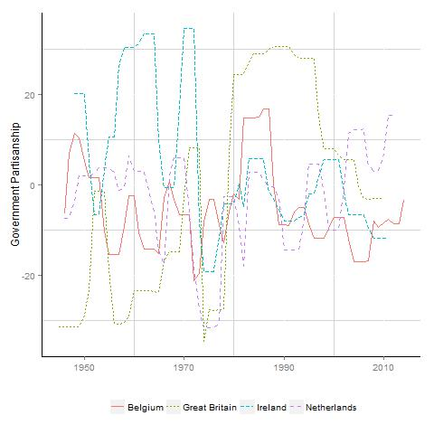

The Seki-Williams dataset updates Woldendorp, Keman and Budge's (2000) Party Government dataset through 2014. This page describes the various datasets, supporting materials and Stata files necessary for creating datsets with a variety of units of analysis. All files are available through [Dataverse](https://doi.org/10.7910/DVN/0UNUAM).

Annual government partisanship (based on MARPOR data) for four European democracies
{:style="display:block; margin-left:auto; margin-right:auto"}

## Datasets
1. **Seki-Williams Governments Dataset (Version 2.0):** contains data on all government parties, government type, seat shares, and other information for all governments in advanced democracies through 2014.
2. **Seki-Williams Ministers Dataset (Version 2.0):** contains data on all government ministers including gender and tenure from the early 1990s through 2014.
3. **Seki-Williams Annual Government Partisanship:** contains annual government partisanship based on the manifesto data and the complexion of government for 37 democracies in the post-WWII period through 2014.
4. **WKB Ministers Data:** Stata version of the original Woldendorp, Keman and Budge data.

## Generation Files
* To generate datasets based on different units of analysis (such as government-party), or temporal dimensions (such as quarterly or monthly), or to create different government partisanship variables, follow the directions in the Seki-Williams Government Partisanship.do (Stata do file) located on [Dataverse](https://doi.org/10.7910/DVN/0UNUAM).

## Supporting Materials
* Codebooks for the Governments, Ministers, and Government Partisanship datasets

## Citation 
* Seki, Katsunori and Laron K. Williams. 2014. "Updating the Party Government Dataset." *Electoral Studies* [Link](https://doi.org/10.1016/j.electstud.2013.10.001)

