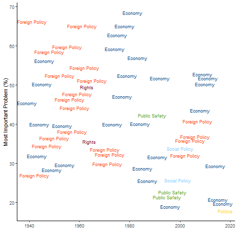

The Most Important Problem Dataset (MIPD) aggregates over 1 million Americans' responses to the 'Most Important Problem' question using survey data from 1939-2020. Responses are partitioned into quasi-responses which are then coded into the MIPD coding scheme. We also collect a variety of demographic (i.e., age, gender, income, class, etc), political variables (i.e., partisan identification, ideology, vote intention), evaluations (i.e., presidential approval and economic evaluations), and ownership perceptions (i.e., best party at handling issues), which can be used in exploratory or inferential analyses. 

**What is the Most Important Problem for Americans?**
{:style="display:block; margin-left:auto; margin-right:auto"}

## Aggregate Data
1. **Explore Issue Salience:** visualize the importance of issue categories (economy, foreign policy, politics, etc) and explore the ebbs and flows of issue salience in America from 1939-2020. [Link](https://williamslaro.shinyapps.io/explore/)

3. **Explore Issue Salience across Groups:** how do the characteristics of respondents shape the importance of various issues? Do Republicans care more about different issues than Democrats? Men and women? Poor and rich? How does geographical region affect which issues are considered "most important"? [Link](https://williamslaro.shinyapps.io/explore_sub/)

4. **Download:** download the aggregate datasets containing the percentages of MIP responses across subgroups of Americans (including partisan identification, gender, income quartiles, and geographic regions) in a variety of temporal domains (survey, annual, quarterly, or monthly). [Link](https://williamslaro.shinyapps.io/mipd/)

## Individual Data
Individual data is available through the [Roper Center for Public Opinion Research](https://doi.org/10.25940/ROPER-31094159).

## Citations
If you use the dataset, please cite the following two companion articles and the dataset:
* Heffington, Colton, Brandon Beomseob Park, and Laron K. Williams. 2019. "The 'Most Important Problem' Dataset (MIPD): A New Dataset on American Issue Importance." *Conflict Management and Peace Science* 36.3: 312-335. [Link](https://doi.org/10.1177/0738894217691463)
* Yildirim, T. Murat and Laron K. Williams. Forthcoming. "Public Importance across Time and Space: Updating the 'Most Important Problem Dataset'". *Journal of Elections, Public Opinion and Parties*. [Link](https://doi.org/10.1080/17457289.2024.2337424)
* The 'Most Important Problem' Dataset (MIPD): A New Dataset on American Issue Importance, Release 1.0 REPLICATION, 1939 [Dataset]. Roper #31094159, Version 2. Not applicable [producer]. Cornell University, Ithaca, NY: Roper Center for Public Opinion Research [distributor]. [Link](https://doi.org/10.25940/ROPER-31094159)
